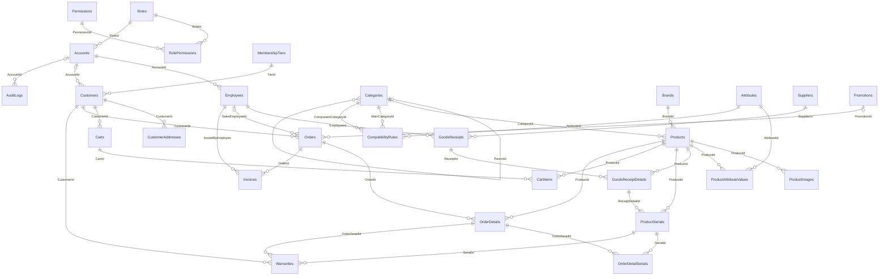

# Từ điển dữ liệu & ERD - LaptopShopDB

> Sinh tự động từ `database/01_schema.sql` (28 bảng). Không sửa tay - sửa comment trong file SQL rồi chạy lại `python tools/gen_dictionary.py`.

## 1. Sơ đồ quan hệ (ERD)

## 2. Danh sách bảng

| # | Bảng | Mô tả |
|---|------|-------|
| 1 | `Roles` | Vai trò trong hệ thống (ADMIN, SALES, WAREHOUSE, CUSTOMER) |
| 2 | `Permissions` | Danh mục quyền chi tiết (vd product.create, order.approve) |
| 3 | `RolePermissions` | Gán quyền cho vai trò (N-N) |
| 4 | `Accounts` | Tài khoản đăng nhập dùng chung (nhân viên, admin, khách hàng) |
| 5 | `Employees` | Hồ sơ nhân viên (quan hệ 1-1 với Accounts) |
| 6 | `MembershipTiers` | Hạng khách hàng thân thiết |
| 7 | `Customers` | Khách hàng (có thể có tài khoản online hoặc khách vãng lai) |
| 8 | `CustomerAddresses` | Sổ địa chỉ giao hàng của khách |
| 9 | `AuditLogs` | Nhật ký thao tác hệ thống (ai làm gì, lúc nào) |
| 10 | `Categories` | Danh mục sản phẩm nhiều cấp (Laptop > Gaming, Linh kiện > RAM...) |
| 11 | `Brands` | Thương hiệu |
| 12 | `Products` | Sản phẩm (laptop, linh kiện, phụ kiện) |
| 13 | `ProductImages` | Ảnh sản phẩm |
| 14 | `Attributes` | Danh mục thuộc tính kỹ thuật (CPU, RAM, chuẩn SSD...) - mô hình EAV |
| 15 | `ProductAttributeValues` | Giá trị thuộc tính của từng sản phẩm |
| 16 | `CompatibilityRules` | Luật tương thích (giá trị thuộc tính của linh kiện phải trùng với máy) |
| 17 | `Suppliers` | Nhà cung cấp / nhà phân phối |
| 18 | `GoodsReceipts` | Phiếu nhập kho |
| 19 | `GoodsReceiptDetails` | Chi tiết phiếu nhập |
| 20 | `ProductSerials` | Từng cá thể sản phẩm có Serial/IMEI (laptop, RAM, SSD...) |
| 21 | `Carts` | Giỏ hàng (mỗi khách 1 giỏ) |
| 22 | `CartItems` | Sản phẩm trong giỏ |
| 23 | `Promotions` | Mã khuyến mãi / voucher |
| 24 | `Orders` | Đơn hàng |
| 25 | `OrderDetails` | Chi tiết đơn hàng |
| 26 | `OrderDetailSerials` | Serial cụ thể đã xuất bán cho từng dòng đơn (gán khi duyệt đơn) |
| 27 | `Invoices` | Hoá đơn bán hàng (phát hành khi duyệt đơn, lưu trữ, in lại được) |
| 28 | `Warranties` | Bảo hành điện tử theo từng Serial (tự tạo khi duyệt đơn) |

## 3. Mô tả chi tiết từng bảng

### Roles

Vai trò trong hệ thống (ADMIN, SALES, WAREHOUSE, CUSTOMER)

| Cột | Kiểu | Null | Khoá | Mặc định | Mô tả |
|-----|------|------|------|----------|-------|
| `RoleId` | INT (IDENTITY) | Không | PK |  | Mã vai trò |
| `RoleCode` | VARCHAR(30) | Không |  |  | Mã code vai trò (ADMIN, SALES...) |
| `RoleName` | NVARCHAR(100) | Không |  |  | Tên hiển thị |
| `Description` | NVARCHAR(255) | Có |  |  | Mô tả |

**Unique:** (RoleCode)

### Permissions

Danh mục quyền chi tiết (vd product.create, order.approve)

| Cột | Kiểu | Null | Khoá | Mặc định | Mô tả |
|-----|------|------|------|----------|-------|
| `PermissionId` | INT (IDENTITY) | Không | PK |  | Mã quyền |
| `PermCode` | VARCHAR(60) | Không |  |  | Mã quyền dạng module.action |
| `PermName` | NVARCHAR(150) | Không |  |  | Tên quyền |
| `ModuleName` | NVARCHAR(50) | Không |  |  | Nhóm chức năng |

**Unique:** (PermCode)

### RolePermissions

Gán quyền cho vai trò (N-N)

| Cột | Kiểu | Null | Khoá | Mặc định | Mô tả |
|-----|------|------|------|----------|-------|
| `RoleId` | INT | Không | PK, FK → Roles |  | Vai trò |
| `PermissionId` | INT | Không | PK, FK → Permissions |  | Quyền |

### Accounts

Tài khoản đăng nhập dùng chung (nhân viên, admin, khách hàng)

| Cột | Kiểu | Null | Khoá | Mặc định | Mô tả |
|-----|------|------|------|----------|-------|
| `AccountId` | INT (IDENTITY) | Không | PK |  | Mã tài khoản |
| `Username` | VARCHAR(50) | Không |  |  | Tên đăng nhập (duy nhất) |
| `Email` | VARCHAR(150) | Có |  |  | Email (duy nhất nếu có) |
| `PasswordHash` | VARCHAR(100) | Không |  |  | Mật khẩu đã băm bcrypt |
| `RoleId` | INT | Không | FK → Roles |  | Vai trò |
| `IsActive` | BIT | Không |  | 1 | 1 = hoạt động, 0 = khoá |
| `LastLoginAt` | DATETIME2(0) | Có |  |  | Lần đăng nhập gần nhất |
| `CreatedAt` | DATETIME2(0) | Không |  | SYSDATETIME() | Ngày tạo |

**Unique:** (Username)

### Employees

Hồ sơ nhân viên (quan hệ 1-1 với Accounts)

| Cột | Kiểu | Null | Khoá | Mặc định | Mô tả |
|-----|------|------|------|----------|-------|
| `EmployeeId` | INT (IDENTITY) | Không | PK |  | Mã nhân viên (khoá) |
| `AccountId` | INT | Không | FK → Accounts |  | Tài khoản đăng nhập |
| `EmployeeCode` | VARCHAR(20) | Không |  |  | Mã nhân viên hiển thị (NV001) |
| `FullName` | NVARCHAR(100) | Không |  |  | Họ tên |
| `Phone` | VARCHAR(15) | Có |  |  | Số điện thoại |
| `Gender` | TINYINT | Có |  |  | 0 = nữ, 1 = nam |
| `BirthDate` | DATE | Có |  |  | Ngày sinh |
| `Address` | NVARCHAR(255) | Có |  |  | Địa chỉ |
| `HireDate` | DATE | Không |  | CAST(SYSDATETIME() AS DATE) | Ngày vào làm |

**Unique:** (AccountId); (EmployeeCode)  
**Check:** `(Gender IN (0,1))`

### MembershipTiers

Hạng khách hàng thân thiết

| Cột | Kiểu | Null | Khoá | Mặc định | Mô tả |
|-----|------|------|------|----------|-------|
| `TierId` | INT (IDENTITY) | Không | PK |  | Mã hạng |
| `TierName` | NVARCHAR(50) | Không |  |  | Tên hạng (Thường, Bạc, Vàng, Kim cương) |
| `MinPoints` | INT | Không |  |  | Điểm tối thiểu để đạt hạng |
| `DiscountPercent` | DECIMAL(5,2) | Không |  | 0 | % ưu đãi |

**Unique:** (TierName)  
**Check:** `(MinPoints >= 0)`; `(DiscountPercent BETWEEN 0 AND 100)`

### Customers

Khách hàng (có thể có tài khoản online hoặc khách vãng lai)

| Cột | Kiểu | Null | Khoá | Mặc định | Mô tả |
|-----|------|------|------|----------|-------|
| `CustomerId` | INT (IDENTITY) | Không | PK |  | Mã khách hàng |
| `AccountId` | INT | Có | FK → Accounts |  | Tài khoản online (NULL = khách vãng lai) |
| `FullName` | NVARCHAR(100) | Không |  |  | Họ tên |
| `Phone` | VARCHAR(15) | Không |  |  | Số điện thoại (duy nhất) |
| `Email` | VARCHAR(150) | Có |  |  | Email |
| `TierId` | INT | Không | FK → MembershipTiers | 1 | Hạng thân thiết |
| `LoyaltyPoints` | INT | Không |  | 0 | Điểm tích luỹ |
| `CompanyName` | NVARCHAR(200) | Có |  |  | Tên doanh nghiệp (xuất hoá đơn công ty) |
| `TaxCode` | VARCHAR(20) | Có |  |  | Mã số thuế |
| `CreatedAt` | DATETIME2(0) | Không |  | SYSDATETIME() | Ngày tạo |

**Unique:** (Phone)  
**Check:** `(LoyaltyPoints >= 0)`

### CustomerAddresses

Sổ địa chỉ giao hàng của khách

| Cột | Kiểu | Null | Khoá | Mặc định | Mô tả |
|-----|------|------|------|----------|-------|
| `AddressId` | INT (IDENTITY) | Không | PK |  | Mã địa chỉ |
| `CustomerId` | INT | Không | FK → Customers |  | Khách hàng |
| `ReceiverName` | NVARCHAR(100) | Không |  |  | Tên người nhận |
| `ReceiverPhone` | VARCHAR(15) | Không |  |  | SĐT người nhận |
| `AddressLine` | NVARCHAR(200) | Không |  |  | Số nhà, đường |
| `Ward` | NVARCHAR(100) | Có |  |  | Phường/Xã |
| `District` | NVARCHAR(100) | Có |  |  | Quận/Huyện |
| `Province` | NVARCHAR(100) | Không |  |  | Tỉnh/Thành phố |
| `IsDefault` | BIT | Không |  | 0 | Địa chỉ mặc định |

### AuditLogs

Nhật ký thao tác hệ thống (ai làm gì, lúc nào)

| Cột | Kiểu | Null | Khoá | Mặc định | Mô tả |
|-----|------|------|------|----------|-------|
| `AuditId` | BIGINT (IDENTITY) | Không | PK |  | Mã log |
| `AccountId` | INT | Có | FK → Accounts |  | Người thực hiện (NULL = hệ thống) |
| `Action` | VARCHAR(50) | Không |  |  | Hành động (LOGIN, CREATE, UPDATE, DELETE...) |
| `EntityName` | VARCHAR(50) | Có |  |  | Đối tượng bị tác động (Product, Order...) |
| `EntityId` | VARCHAR(50) | Có |  |  | Khoá của đối tượng |
| `Detail` | NVARCHAR(1000) | Có |  |  | Chi tiết |
| `IpAddress` | VARCHAR(45) | Có |  |  | Địa chỉ IP |
| `CreatedAt` | DATETIME2(0) | Không |  | SYSDATETIME() | Thời điểm |

### Categories

Danh mục sản phẩm nhiều cấp (Laptop > Gaming, Linh kiện > RAM...)

| Cột | Kiểu | Null | Khoá | Mặc định | Mô tả |
|-----|------|------|------|----------|-------|
| `CategoryId` | INT (IDENTITY) | Không | PK |  | Mã danh mục |
| `ParentId` | INT | Có | FK → Categories |  | Danh mục cha (NULL = gốc) |
| `CategoryName` | NVARCHAR(100) | Không |  |  | Tên danh mục |
| `Slug` | VARCHAR(120) | Không |  |  | Đường dẫn thân thiện URL |
| `SortOrder` | INT | Không |  | 0 | Thứ tự hiển thị |
| `IsActive` | BIT | Không |  | 1 | Đang sử dụng |

**Unique:** (Slug)

### Brands

Thương hiệu

| Cột | Kiểu | Null | Khoá | Mặc định | Mô tả |
|-----|------|------|------|----------|-------|
| `BrandId` | INT (IDENTITY) | Không | PK |  | Mã thương hiệu |
| `BrandName` | NVARCHAR(100) | Không |  |  | Tên thương hiệu |
| `Country` | NVARCHAR(60) | Có |  |  | Quốc gia |
| `LogoUrl` | VARCHAR(300) | Có |  |  | Đường dẫn logo |
| `IsActive` | BIT | Không |  | 1 | Đang sử dụng |

**Unique:** (BrandName)

### Products

Sản phẩm (laptop, linh kiện, phụ kiện)

| Cột | Kiểu | Null | Khoá | Mặc định | Mô tả |
|-----|------|------|------|----------|-------|
| `ProductId` | INT (IDENTITY) | Không | PK |  | Mã sản phẩm |
| `Sku` | VARCHAR(40) | Không |  |  | Mã SKU / mã model |
| `ProductName` | NVARCHAR(200) | Không |  |  | Tên sản phẩm |
| `Slug` | VARCHAR(220) | Không |  |  | Đường dẫn thân thiện URL |
| `CategoryId` | INT | Không | FK → Categories |  | Danh mục |
| `BrandId` | INT | Không | FK → Brands |  | Thương hiệu |
| `ShortDesc` | NVARCHAR(500) | Có |  |  | Mô tả ngắn |
| `Description` | NVARCHAR(MAX) | Có |  |  | Mô tả chi tiết |
| `CostPrice` | DECIMAL(18,0) | Không |  | 0 | Giá nhập gần nhất |
| `SalePrice` | DECIMAL(18,0) | Không |  |  | Giá bán niêm yết |
| `WarrantyMonths` | INT | Không |  | 12 | Bảo hành tiêu chuẩn (tháng) |
| `IsSerialTracked` | BIT | Không |  | 0 | 1 = quản lý theo Serial/IMEI |
| `IsActive` | BIT | Không |  | 1 | 1 = đang bán, 0 = ẩn |
| `QtyOnHand` | INT | Không |  | 0 | Tồn thực tế trong kho (gộp từ bảng Inventory cũ) |
| `QtyReserved` | INT | Không |  | 0 | Đã giữ chỗ cho đơn chờ duyệt |
| `ReorderLevel` | INT | Không |  | 3 | Ngưỡng cảnh báo sắp hết |
| `CreatedAt` | DATETIME2(0) | Không |  | SYSDATETIME() | Ngày tạo |
| `UpdatedAt` | DATETIME2(0) | Không |  | SYSDATETIME() | Ngày cập nhật |

**Unique:** (Sku); (Slug)  
**Check:** `(SalePrice >= 0 AND CostPrice >= 0)`; `(WarrantyMonths >= 0)`; `(QtyOnHand >= 0 AND QtyReserved >= 0 AND ReorderLevel >= 0 AND QtyReserved <= QtyOnHand)`

### ProductImages

Ảnh sản phẩm

| Cột | Kiểu | Null | Khoá | Mặc định | Mô tả |
|-----|------|------|------|----------|-------|
| `ImageId` | INT (IDENTITY) | Không | PK |  | Mã ảnh |
| `ProductId` | INT | Không | FK → Products |  | Sản phẩm |
| `ImageUrl` | VARCHAR(300) | Không |  |  | Đường dẫn ảnh |
| `IsPrimary` | BIT | Không |  | 0 | Ảnh đại diện |
| `SortOrder` | INT | Không |  | 0 | Thứ tự |

### Attributes

Danh mục thuộc tính kỹ thuật (CPU, RAM, chuẩn SSD...) - mô hình EAV

| Cột | Kiểu | Null | Khoá | Mặc định | Mô tả |
|-----|------|------|------|----------|-------|
| `AttributeId` | INT (IDENTITY) | Không | PK |  | Mã thuộc tính |
| `AttrCode` | VARCHAR(40) | Không |  |  | Mã code (CPU, RAM_TYPE...) |
| `AttrName` | NVARCHAR(100) | Không |  |  | Tên hiển thị |
| `Unit` | NVARCHAR(20) | Có |  |  | Đơn vị (GB, Hz, kg, inch) |
| `IsFilterable` | BIT | Không |  | 0 | Cho phép lọc ở trang cửa hàng |

**Unique:** (AttrCode)

### ProductAttributeValues

Giá trị thuộc tính của từng sản phẩm

| Cột | Kiểu | Null | Khoá | Mặc định | Mô tả |
|-----|------|------|------|----------|-------|
| `ProductId` | INT | Không | PK, FK → Products |  | Sản phẩm |
| `AttributeId` | INT | Không | PK, FK → Attributes |  | Thuộc tính |
| `AttrValue` | NVARCHAR(200) | Không |  |  | Giá trị (vd: DDR5, 16GB) |

### CompatibilityRules

Luật tương thích (giá trị thuộc tính của linh kiện phải trùng với máy)

| Cột | Kiểu | Null | Khoá | Mặc định | Mô tả |
|-----|------|------|------|----------|-------|
| `RuleId` | INT (IDENTITY) | Không | PK |  | Mã luật |
| `MainCategoryId` | INT | Không | FK → Categories |  | Danh mục sản phẩm chính (Laptop) |
| `ComponentCategoryId` | INT | Không | FK → Categories |  | Danh mục linh kiện (RAM, SSD) |
| `AttributeId` | INT | Không | FK → Attributes |  | Thuộc tính phải khớp (RAM_TYPE, SSD_INTERFACE) |
| `Description` | NVARCHAR(255) | Có |  |  | Diễn giải luật |

**Unique:** (MainCategoryId, ComponentCategoryId, AttributeId)

### Suppliers

Nhà cung cấp / nhà phân phối

| Cột | Kiểu | Null | Khoá | Mặc định | Mô tả |
|-----|------|------|------|----------|-------|
| `SupplierId` | INT (IDENTITY) | Không | PK |  | Mã nhà cung cấp |
| `SupplierName` | NVARCHAR(200) | Không |  |  | Tên nhà cung cấp |
| `TaxCode` | VARCHAR(20) | Có |  |  | Mã số thuế |
| `ContactName` | NVARCHAR(100) | Có |  |  | Người liên hệ |
| `Phone` | VARCHAR(15) | Có |  |  | Điện thoại |
| `Email` | VARCHAR(150) | Có |  |  | Email |
| `Address` | NVARCHAR(255) | Có |  |  | Địa chỉ |
| `PaymentTermDays` | INT | Không |  | 30 | Hạn thanh toán (ngày) |
| `IsActive` | BIT | Không |  | 1 | Đang hợp tác |

**Check:** `(PaymentTermDays >= 0)`

### GoodsReceipts

Phiếu nhập kho

| Cột | Kiểu | Null | Khoá | Mặc định | Mô tả |
|-----|------|------|------|----------|-------|
| `ReceiptId` | INT (IDENTITY) | Không | PK |  | Mã phiếu nhập |
| `ReceiptNo` | VARCHAR(20) | Không |  |  | Số phiếu (PN2609-00001) |
| `SupplierId` | INT | Không | FK → Suppliers |  | Nhà cung cấp |
| `EmployeeId` | INT | Không | FK → Employees |  | Nhân viên lập phiếu |
| `ReceiptDate` | DATETIME2(0) | Không |  | SYSDATETIME() | Ngày nhập |
| `Status` | VARCHAR(10) | Không |  | 'Draft' | Draft / Posted / Cancelled |
| `TotalAmount` | DECIMAL(18,0) | Không |  | 0 | Tổng tiền hàng |
| `PaidAmount` | DECIMAL(18,0) | Không |  | 0 | Đã thanh toán cho NCC |
| `DueDate` | DATE | Có |  |  | Hạn thanh toán |
| `Note` | NVARCHAR(255) | Có |  |  | Ghi chú |

**Unique:** (ReceiptNo)  
**Check:** `(Status IN ('Draft','Posted','Cancelled'))`; `(PaidAmount >= 0 AND PaidAmount <= TotalAmount OR Status = 'Draft')`

### GoodsReceiptDetails

Chi tiết phiếu nhập

| Cột | Kiểu | Null | Khoá | Mặc định | Mô tả |
|-----|------|------|------|----------|-------|
| `ReceiptDetailId` | INT (IDENTITY) | Không | PK |  | Mã dòng chi tiết |
| `ReceiptId` | INT | Không | FK → GoodsReceipts |  | Phiếu nhập |
| `ProductId` | INT | Không | FK → Products |  | Sản phẩm |
| `Quantity` | INT | Không |  |  | Số lượng nhập |
| `UnitCost` | DECIMAL(18,0) | Không |  |  | Đơn giá nhập |
| `LineTotal` | Computed | Không |  |  | Thành tiền (cột tính toán) |

**Unique:** (ReceiptId, ProductId)  
**Check:** `(Quantity > 0)`; `(UnitCost >= 0)`

### ProductSerials

Từng cá thể sản phẩm có Serial/IMEI (laptop, RAM, SSD...)

| Cột | Kiểu | Null | Khoá | Mặc định | Mô tả |
|-----|------|------|------|----------|-------|
| `SerialId` | BIGINT (IDENTITY) | Không | PK |  | Mã cá thể |
| `ProductId` | INT | Không | FK → Products |  | Sản phẩm |
| `SerialNumber` | VARCHAR(60) | Không |  |  | Số Serial (duy nhất toàn hệ thống) |
| `Imei` | VARCHAR(20) | Có |  |  | IMEI (nếu có) |
| `Barcode` | VARCHAR(50) | Có |  |  | Mã vạch |
| `ReceiptDetailId` | INT | Không | FK → GoodsReceiptDetails |  | Nhập từ dòng phiếu nhập nào |
| `Status` | VARCHAR(12) | Không |  | 'Pending' | Pending/InStock/Sold/InWarranty/SentToVendor/Defective |

**Unique:** (SerialNumber)  
**Check:** `(Status IN ('Pending','InStock','Sold','InWarranty','SentToVendor','Defective'))`

### Carts

Giỏ hàng (mỗi khách 1 giỏ)

| Cột | Kiểu | Null | Khoá | Mặc định | Mô tả |
|-----|------|------|------|----------|-------|
| `CartId` | INT (IDENTITY) | Không | PK |  | Mã giỏ |
| `CustomerId` | INT | Không | FK → Customers |  | Khách hàng |
| `UpdatedAt` | DATETIME2(0) | Không |  | SYSDATETIME() | Cập nhật lần cuối |

**Unique:** (CustomerId)

### CartItems

Sản phẩm trong giỏ

| Cột | Kiểu | Null | Khoá | Mặc định | Mô tả |
|-----|------|------|------|----------|-------|
| `CartId` | INT | Không | PK, FK → Carts |  | Giỏ hàng |
| `ProductId` | INT | Không | PK, FK → Products |  | Sản phẩm |
| `Quantity` | INT | Không |  |  | Số lượng |
| `AddedAt` | DATETIME2(0) | Không |  | SYSDATETIME() | Thời điểm thêm |

**Check:** `(Quantity BETWEEN 1 AND 99)`

### Promotions

Mã khuyến mãi / voucher

| Cột | Kiểu | Null | Khoá | Mặc định | Mô tả |
|-----|------|------|------|----------|-------|
| `PromotionId` | INT (IDENTITY) | Không | PK |  | Mã khuyến mãi |
| `Code` | VARCHAR(30) | Không |  |  | Mã voucher nhập khi thanh toán |
| `PromoName` | NVARCHAR(150) | Không |  |  | Tên chương trình |
| `DiscountType` | VARCHAR(10) | Không |  |  | Percent (theo %) hoặc Amount (số tiền) |
| `DiscountValue` | DECIMAL(18,2) | Không |  |  | Giá trị giảm |
| `MinOrderAmount` | DECIMAL(18,0) | Không |  | 0 | Đơn tối thiểu để áp dụng |
| `MaxDiscount` | DECIMAL(18,0) | Có |  |  | Giảm tối đa (cho loại %) |
| `StartDate` | DATETIME2(0) | Không |  |  | Bắt đầu |
| `EndDate` | DATETIME2(0) | Không |  |  | Kết thúc |
| `UsageLimit` | INT | Có |  |  | Số lượt dùng tối đa (NULL = không giới hạn) |
| `UsedCount` | INT | Không |  | 0 | Đã dùng |
| `IsActive` | BIT | Không |  | 1 | Đang bật |

**Unique:** (Code)  
**Check:** `(DiscountType IN ('Percent','Amount'))`; `(DiscountValue > 0 AND (DiscountType = 'Amount' OR DiscountValue <= 100))`; `(EndDate >= StartDate)`; `(UsedCount >= 0 AND (UsageLimit IS NULL OR UsedCount <= UsageLimit))`

### Orders

Đơn hàng

| Cột | Kiểu | Null | Khoá | Mặc định | Mô tả |
|-----|------|------|------|----------|-------|
| `OrderId` | INT (IDENTITY) | Không | PK |  | Mã đơn |
| `OrderNo` | VARCHAR(20) | Không |  |  | Số đơn hiển thị (DH2609-00001) |
| `CustomerId` | INT | Không | FK → Customers |  | Khách đặt |
| `SalesEmployeeId` | INT | Có | FK → Employees |  | Nhân viên duyệt/xử lý |
| `PromotionId` | INT | Có | FK → Promotions |  | Khuyến mãi đã áp dụng |
| `Status` | VARCHAR(10) | Không |  | 'Pending' | Pending / Approved / Completed / Cancelled |
| `PaymentMethod` | VARCHAR(15) | Không |  |  | COD / BankTransfer / Card / Installment / Cash |
| `PaymentStatus` | VARCHAR(10) | Không |  | 'Pending' | Pending / Paid / Refunded (gộp từ bảng Payments cũ) |
| `PaidAt` | DATETIME2(0) | Có |  |  | Thời điểm thanh toán |
| `ReceiverName` | NVARCHAR(100) | Không |  |  | Người nhận (snapshot) |
| `ReceiverPhone` | VARCHAR(15) | Không |  |  | SĐT nhận (snapshot) |
| `ShippingAddress` | NVARCHAR(400) | Không |  |  | Địa chỉ giao (snapshot) |
| `Subtotal` | DECIMAL(18,0) | Không |  |  | Tổng tiền hàng |
| `DiscountAmount` | DECIMAL(18,0) | Không |  | 0 | Giảm giá |
| `ShippingFee` | DECIMAL(18,0) | Không |  | 0 | Phí vận chuyển |
| `VatRate` | DECIMAL(5,2) | Không |  | 10 | Thuế suất VAT (%) |
| `VatAmount` | Computed | Không |  |  | Tiền VAT (cột tính toán) |
| `TotalAmount` | Computed | Không |  |  | Tổng thanh toán (cột tính toán) |
| `Note` | NVARCHAR(500) | Có |  |  | Ghi chú của khách |
| `CancelReason` | NVARCHAR(255) | Có |  |  | Lý do huỷ |
| `CreatedAt` | DATETIME2(0) | Không |  | SYSDATETIME() | Ngày đặt |
| `ApprovedAt` | DATETIME2(0) | Có |  |  | Ngày duyệt |
| `CompletedAt` | DATETIME2(0) | Có |  |  | Ngày hoàn tất giao hàng |
| `CancelledAt` | DATETIME2(0) | Có |  |  | Ngày huỷ |

**Unique:** (OrderNo)  
**Check:** `(Status IN ('Pending','Approved','Completed','Cancelled'))`; `(PaymentMethod IN ('COD','BankTransfer','Card','Installment','Cash'))`; `(PaymentStatus IN ('Pending','Paid','Refunded'))`; `(Subtotal >= 0 AND DiscountAmount >= 0 AND DiscountAmount <= Subtotal AND ShippingFee >= 0)`

### OrderDetails

Chi tiết đơn hàng

| Cột | Kiểu | Null | Khoá | Mặc định | Mô tả |
|-----|------|------|------|----------|-------|
| `OrderDetailId` | INT (IDENTITY) | Không | PK |  | Mã dòng chi tiết |
| `OrderId` | INT | Không | FK → Orders |  | Đơn hàng |
| `ProductId` | INT | Không | FK → Products |  | Sản phẩm |
| `Quantity` | INT | Không |  |  | Số lượng |
| `UnitPrice` | DECIMAL(18,0) | Không |  |  | Đơn giá bán tại thời điểm đặt |
| `CostPrice` | DECIMAL(18,0) | Không |  |  | Giá vốn tại thời điểm đặt (tính lợi nhuận) |
| `WarrantyMonths` | INT | Không |  |  | Số tháng bảo hành áp dụng |
| `LineTotal` | Computed | Không |  |  | Thành tiền (cột tính toán) |

**Unique:** (OrderId, ProductId)  
**Check:** `(Quantity > 0)`; `(UnitPrice >= 0 AND CostPrice >= 0 AND WarrantyMonths >= 0)`

### OrderDetailSerials

Serial cụ thể đã xuất bán cho từng dòng đơn (gán khi duyệt đơn)

| Cột | Kiểu | Null | Khoá | Mặc định | Mô tả |
|-----|------|------|------|----------|-------|
| `OrderDetailId` | INT | Không | PK, FK → OrderDetails |  | Dòng chi tiết đơn |
| `SerialId` | BIGINT | Không | PK, FK → ProductSerials |  | Cá thể sản phẩm đã bán |

### Invoices

Hoá đơn bán hàng (phát hành khi duyệt đơn, lưu trữ, in lại được)

| Cột | Kiểu | Null | Khoá | Mặc định | Mô tả |
|-----|------|------|------|----------|-------|
| `InvoiceId` | INT (IDENTITY) | Không | PK |  | Mã hoá đơn |
| `InvoiceNo` | VARCHAR(20) | Không |  |  | Số hoá đơn (HD2609-00001) |
| `OrderId` | INT | Không | FK → Orders |  | Đơn hàng (1 đơn - 1 hoá đơn) |
| `IssuedByEmployee` | INT | Không | FK → Employees |  | Nhân viên phát hành |
| `IssuedAt` | DATETIME2(0) | Không |  | SYSDATETIME() | Ngày phát hành |
| `BuyerName` | NVARCHAR(100) | Không |  |  | Tên người mua |
| `BuyerCompany` | NVARCHAR(200) | Có |  |  | Tên đơn vị (nếu xuất công ty) |
| `BuyerTaxCode` | VARCHAR(20) | Có |  |  | MST người mua |
| `BuyerAddress` | NVARCHAR(400) | Không |  |  | Địa chỉ người mua |
| `SubtotalAmount` | DECIMAL(18,0) | Không |  |  | Tiền hàng |
| `DiscountAmount` | DECIMAL(18,0) | Không |  |  | Giảm giá |
| `VatAmount` | DECIMAL(18,0) | Không |  |  | Tiền VAT |
| `TotalAmount` | DECIMAL(18,0) | Không |  |  | Tổng thanh toán |
| `PrintCount` | INT | Không |  | 0 | Số lần đã in |
| `Status` | VARCHAR(10) | Không |  | 'Issued' | Issued / Voided |

**Unique:** (InvoiceNo); (OrderId)  
**Check:** `(Status IN ('Issued','Voided'))`

### Warranties

Bảo hành điện tử theo từng Serial (tự tạo khi duyệt đơn)

| Cột | Kiểu | Null | Khoá | Mặc định | Mô tả |
|-----|------|------|------|----------|-------|
| `WarrantyId` | INT (IDENTITY) | Không | PK |  | Mã bảo hành |
| `SerialId` | BIGINT | Không | FK → ProductSerials |  | Cá thể được bảo hành |
| `OrderDetailId` | INT | Không | FK → OrderDetails |  | Dòng đơn hàng đã bán |
| `CustomerId` | INT | Không | FK → Customers |  | Khách hàng sở hữu |
| `StartDate` | DATE | Không |  |  | Ngày bắt đầu |
| `EndDate` | DATE | Không |  |  | Ngày hết hạn |
| `Status` | VARCHAR(10) | Không |  | 'Active' | Active / Voided |

**Unique:** (SerialId, OrderDetailId)  
**Check:** `(EndDate >= StartDate)`; `(Status IN ('Active','Voided'))`
